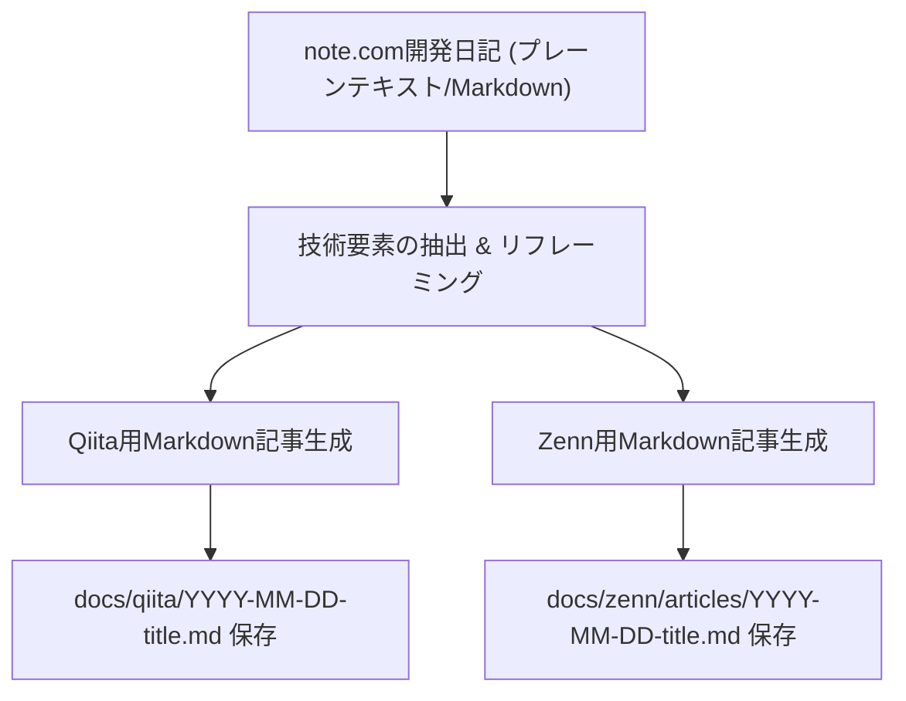

# note-to-tech-blog スキルガイド

本スキルは、note.com向けにプレーンテキストやエッセイ風に執筆された開発日記・開発秘話を入力とし、**Qiita**および**Zenn**のプラットフォーム文化・Markdown仕様・読者層に最適化した高品質な技術記事（Markdown形式）を生成・保存するためのワークフローを定義します。

---

## 🎯 目的と変換コンセプト

note.com、Qiita、Zennは読者層と求められる文脈が大きく異なります。

| プラットフォーム | 主な読者層 | 好まれるコンテンツ | 文体・トーン | 記法・機能 |
|---|---|---|---|---|
| **note.com** | 幅広い一般読者・個人投資家・ファン | 開発の苦労話、ストーリー、人間味、思想 | 親しみやすい「です・ます調」、日常の比喩 | プレーンテキスト（装飾控えめ）、画像中心 |
| **Qiita** | 課題解決・実装ノウハウを探すエンジニア | 具体的な解決策、実装Tips、技術選定の理由、再現可能な手順 | 「だ・である調」または簡潔な「です・ます調」、技術主導 | YAML Frontmatter、`:::note info/warn`、コードブロック、テーブル |
| **Zenn** | モダン技術・個人開発に関心のあるエンジニア | 開発体験談、アーキテクチャ設計、試行錯誤の知見、使ってみた系 | 軽快で誠実な「です・ます調」、読みやすい構成 | Zenn Frontmatter（絵文字・トピック）、`:::message`、`:::details`、ファイル名付きコードブロック |

本スキルでは、単なるフォーマット変換にとどまらず、**「技術者コミュニティで価値のある知見」を抽出し、プラットフォーム特性に合わせて再構成（リフレーミング）**します。

---

## 📋 変換ワークフロー



### ステップ1：ソース記事の解析
元となるnote記事から以下の要素を抽出します。
1. **背景と課題**: 何を作ろうとして、どんな課題があったか？
2. **コアアイデア・アーキテクチャ**: どのような設計原則や技術選定で解決したか？
3. **具体的な実装プロセス**: どのようなステップ・タイムラインで進めたか？
4. **失敗・落とし穴と対策**: どこで詰まり、どう克服したか？
5. **得られた知見（Key Takeaways）**: 他のエンジニアが真似できる教訓は何か？

### ステップ2：プラットフォーム別最適化

#### 1. Qiita向け変換ルール
- **Frontmatter（Qiita CLI形式）**:
  ```yaml
  ---
  title: タイトル（検索キーワードを含め、具体的な知見・結果を明示）
  tags:
    - タグ1（主要技術名: 例 Python）
    - タグ2（主要技術名: 例 FastAPI）
    - タグ3（フレームワーク・ツール: 例 Claude / AIエージェント）
    - タグ4（カテゴリ: 例 個人開発）
    - タグ5（最大5個まで）
  private: false
  ---
  ```
- **タイトルの特徴**:
  - 技術名・ツールの名前を明確に入れる。
  - 「〜した話」「〜の設計原則」「〜する方法」など、ノウハウや解決策が想起できる構成にする。
- **本文の構成と記法**:
  - 冒頭に「TL;DR / 要約」を配置し、読者がすぐに結論を把握できるようにする。
  - 補足情報や重要ポイントにはQiita独自記法を活用する：
    ```markdown
    :::note info
    ポイントや補足事項
    :::
    :::note warn
    注意点やハマりどころ
    :::
    ```
  - コードやプロンプトは適切な言語指定を行い、シンタックスハイライトを適用する。
  - 抽象的な話だけでなく、アーキテクチャやルールなどの表・リストを整理する。

#### 2. Zenn向け変換ルール
- **Frontmatter（Zenn CLI形式）**:
  ```yaml
  ---
  title: "タイトル（魅力的で共感を呼び、開発ストーリーの核心を突くもの）"
  emoji: "🛠️" # 記事のテーマに合った絵文字を1つ指定
  type: "tech" # 技術記事は "tech", アイデア・ポエムは "idea"
  topics: ["claudecode", "python", "fastapi", "nextjs", "個人開発"] # 最大5個、英数字・ハイフン推奨
  published: false # 下書き保存時は false
  ---
  ```
- **タイトルの特徴**:
  - 開発者の共感を呼ぶキャッチーなフレーズ。
  - 「Claude Codeと25時間で駆け抜けた〜」「AIを迷走させない〜」など、体験と知見が伝わるタイトル。
- **本文の構成と記法**:
  - タイトル直下にリード文と `:::message` によるサマリーを配置。
  - Zenn独自記法を活用する：
    ```markdown
    :::message
    この記事で伝えたい核心メッセージ
    :::
    :::message alert
    注意すべき制約やリスク
    :::
    :::details 詳細なログや設定を見る（折りたたみ）
    長いコードや補足の会話ログなど
    :::
    ```
  - コードブロックにはファイル名を付与する（例: ` ```python:backend/app/main.py ` ）。
  - 各セクションの見出しは `#`（H1）または `##`（H2）から統一して階層構造を整える。
  - サマリー表示には `:::message` を使用し、英語略語（TL;DR）ではなく「要約」など明確な日本語表記を推奨する。

---

## 🏷️ タイトル・タグ生成ルール

### タイトル生成の比較
| 元記事 (note.com) | Qiita向け（ノウハウ・検索性重視） | Zenn向け（体験・ストーリー・共感重視） |
|---|---|---|
| 【ALPHA FORGE 開発秘話 #01】構築プロンプト1枚から、2日で「育つAI端末」が立ち上がるまで | Claude CodeにフルスタックAI端末を25時間で作らせた設計原則 〜コードを書かせる前に「制約」を書き切る〜 | Claude Codeと25時間で駆け抜けたAI投資端末開発記：AIを迷走させない「制約駆動」アプローチ |

### ハッシュタグ / トピックの変換ルール
- note: `#個人開発 #ClaudeCode #AIエージェント #Python #FastAPI #NextJS #機械学習 #日本株`
- **Qiita (tags: 最大5個)**:
  - `Claude`, `AIエージェント`, `個人開発`, `FastAPI`, `Next.js`
- **Zenn (topics: 最大5個、半角英数字/ハイフン/アンダースコア)**:
  - `claudecode`, `ai`, `個人開発`, `fastapi`, `nextjs`

---

## 📁 推奨出力先ディレクトリ

- **Qiita記事**: `docs/qiita/YYYY-MM-DD-記事スラッグ.md`
- **Zenn記事**: `docs/zenn/articles/YYYY-MM-DD-記事スラッグ.md`
- （プロジェクト内のアーカイブとして `docs/note/YYYY-MM-DD/` 配下にも格納可能）

---

## ✍️ ユーザーの投稿時修正から得たルール（2026-09-24、第2話の投稿版との差分より）

実際にユーザーが投稿時に手で直した箇所。次回以降は最初からこの形で書く。

1. **元記事（note）へのリンクは、要約ブロックの外に出してURLを単独行で置く**（リンクカードとして表示させるため）
   - `:::message`／`:::note info` の中に `［…］(URL)` を入れない。ブロックを閉じた直後に置く。
   - Zenn:
     ```markdown
     :::

     ※本記事はnote連載［ALPHA FORGE 開発秘話 #NN］を、開発者向けに再構成したものです。
     https://note.com/featured_stocks/n/xxxxxxxx
     ```
   - Qiita（URLの前に空行を1行入れる）:
     ```markdown
     :::

     ※本記事はnote連載［ALPHA FORGE 開発秘話 #NN］ の技術的な部分を、エンジニア向けに再構成したものです。

     https://note.com/featured_stocks/n/xxxxxxxx
     ```
2. **本文の大見出しの間に `---`（水平線）を入れない**。見出しだけで区切る。`---` を使うのは、末尾の免責ブロックの直前の1本だけにする。
3. **太字で「」を囲まない**。`端末**「ALPHA FORGE」**を` のように、文字の直後の `**` の次にかぎかっこが来ると、太字にならず `**` がそのまま表示される（CommonMark の仕様）。`「**ALPHA FORGE**」` のように、太字はかっこの内側に置く。
4. タイトル・タグ・トピック・絵文字は、投稿時に変更されなかった。現行ルールのままでよい。
5. Zenn・Qiita ともWebエディタに貼り付けて投稿している。先頭の設定欄（frontmatter）は記録用にファイルへ残し、エディタには本文だけを貼る前提で書く。

## ✅ 事実確認（2026-09-24 追加）

- 技術スタック・ファイル名・機能は、実装（`frontend/package.json`、`plans/`、`backend/services/` など）で確認してから書く。前日の第1話で Next.js 14・Tailwind・架空の計画書ファイル名・Slack通知を書いてしまい、あとで修正した。
- 前身ツールの固有名は、ファイル名の一部も含めて出さない（「前身ツール」と書く）。
- コード例は実際のコミットからの抜粋にし、抜粋である旨を書く。

## 🛠️ チェックリスト

変換完了時は以下の項目を確認してください。
- [ ] Frontmatterの構文エラーがないか（タグ数や型、真偽値など）
- [ ] プラットフォーム独自記法（`:::note` / `:::message` / `:::details`）が正しく閉じられているか
- [ ] コードブロックに言語名やファイル名が指定されているか
- [ ] プレーンテキストの箇条書きや記号が適切なMarkdownリスト/見出しに変換されているか
- [ ] 金融商品取引法の定型免責ブロック（【システム検証記録に関する免責事項・注意事項】）が保持され、NG表現（推奨買値・損切りライン・推奨銘柄等）が検証用語へ置換されているか（`NOTE.md` コンプライアンス §2〜§4）
- [ ] 冒頭および文末にnote.com（元記事・デイリー連載）への誘導リンク（CTA）が自然に挿入されているか
- [ ] 読者層に合わせた自然な導入と結びになっているか
