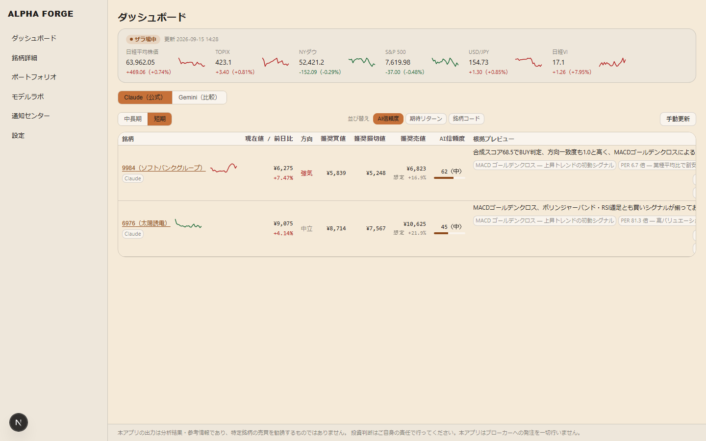
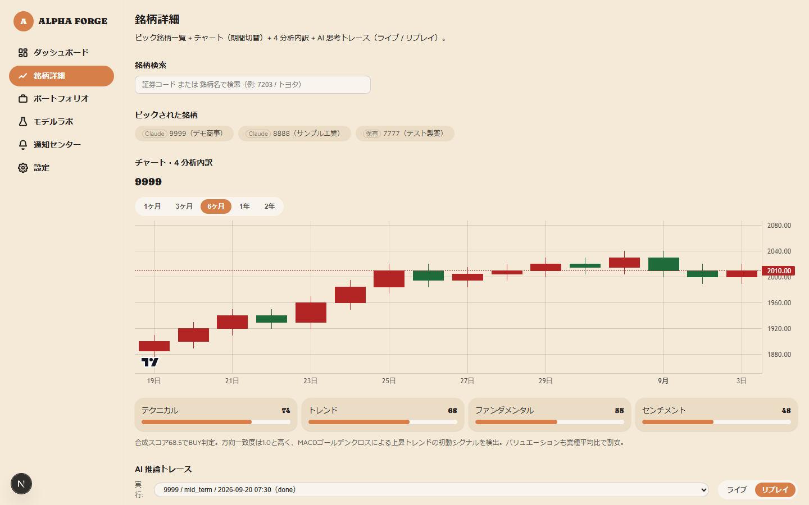
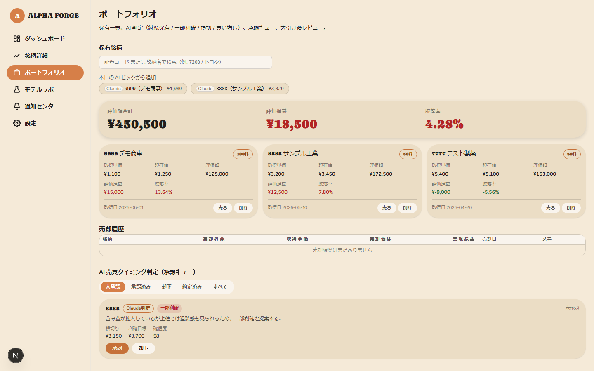
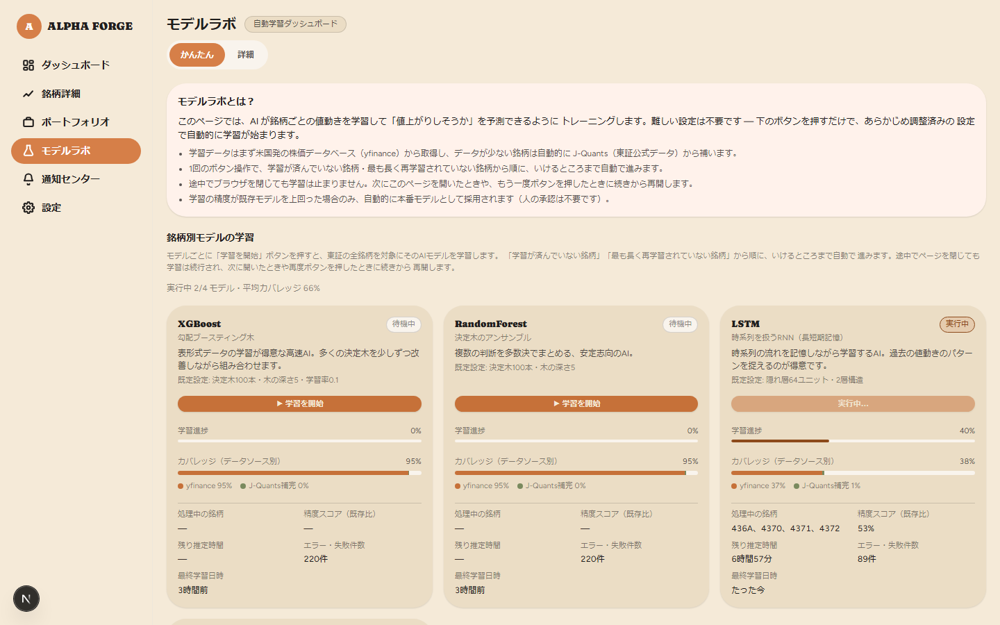

# ALPHA FORGE

[](https://github.com/charge0315/claude-code-market-lens/actions/workflows/ci.yml)


日本株（東証、銘柄コード 4 桁）の **AI 銘柄ピック**（中長期 / 短期）を、
根拠・推奨買値・損切値・推奨売値の 3 値つきで毎朝自動生成し、
予測を台帳化して決着結果から学習し直す **継続学習ループ**、
そして推論パイプライン（収集 → サブスコア → 合成 → LLM 深掘り → ブラケット → 検証）を
端末上でライブに見せる **AI 思考の可視化** を備えたトレーディング支援端末です。

> 本アプリの出力は分析結果・参考情報であり、投資助言ではありません。
> **ブローカーへの発注は一切行いません。** 約定は利用者が手動で行います。

## スクリーンショット

<table>
<tr>
<td width="50%">

**ダッシュボード** — 主要指数のライブティッカー、ポートフォリオ概況（評価額合計・評価損益・
騰落率）、Claude / Gemini 2 系統の AI 信頼度付きピック一覧。銘柄名・金額はデモ用にマスキング済み。



</td>
<td width="50%">

**銘柄詳細 — AI 思考の可視化** — チャート + 4 分析内訳 + 推論パイプラインの
各ステップ（収集 / サブスコア / 合成 / LLM 深掘り / ブラケット / 検証）を
ライブ・リプレイで追跡。銘柄名はデモ用にマスキング済み。



</td>
</tr>
<tr>
<td width="50%">

**ポートフォリオ** — トータル収支を大きく強調表示し、保有銘柄の評価損益と AI 売買タイミング
判定の承認キューを一覧（**発注は自動化せず、人間の承認を必須化**）。銘柄名・金額はデモ用に
マスキング済み。



</td>
<td width="50%">

**モデルラボ** — XGBoost / RandomForest / LSTM の champion–challenger 学習を
ワンクリックで実行し、昇格判定は自動評価のみ（適用は人手承認）。



</td>
</tr>
</table>

## 特徴

- **3 値必須の売買提案** — AI が銘柄を提案する全機能で「推奨買値 / 損切値 / 推奨売値」を必ず明記。サーバ側で価格の整合性を検証し、不整合は却下する。
- **継続学習ループ** — すべての予測を台帳化し、複数ホライズンで決着を記録。夜間の軽量再学習・週次フル再学習・ドリフト検知（PSI）を自走スケジュールで回す。
- **champion / challenger モデル運用** — challenger は shadow 推論で並走し、ホールドアウト超過・較正非悪化・直近成績非劣化のすべてを満たした場合のみ昇格を**提案**（自動反映はしない）。
- **承認制ポートフォリオ** — AI はチケットを生成するだけで自動約定しない。ブローカー発注は一切行わない。
- **プロンプトインジェクション対策** — Vault・ニュース等の外部由来本文は LLM プロンプトへ注入せず、構造化フィールドのみを利用する境界をテストで固定。
- **国内証券標準の UI** — 上昇 = 赤 / 下落 = 緑、JST 基準の時刻表示、高密度・低余白のプロ端末デザイン。

## 構成

| レイヤー | 技術 | ポート |
|:--|:--|:--|
| frontend | Next.js 16 + TypeScript (strict) / Vanilla CSS | 3001 |
| backend | FastAPI + Python 3.11 | 8002 |
| DB | SQLite + Alembic | — |
| 非同期 | Celery + Redis（DB 番号 4 / 5） | — |

```
scripts/
  export_openapi.py  OpenAPI スキーマ再エクスポート
  generate_cover.py  note 見出し画像（00_cover.png）生成
backend/
  main.py            FastAPI アプリ（/health, /api/health）
  config.py          env 一元（起動時 fail-fast）
  celery_app.py      Celery 設定（beat スケジュール一元、_BEAT_SCHEDULE 参照）
  alembic/           マイグレーション（0001_baseline に全ドメインテーブル）
  routers/           HTTP / WS エンドポイント
  services/          ドメインロジック
frontend/
  src/app/           dashboard / stock-detail / chart / portfolio / model-lab / notifications / settings
  src/components/    ui / layout / pipeline / dashboard / portfolio / notify / model-lab / stock-detail / chart
  src/lib/           API クライアント / SSE・WS クライアント / push（Web Push）
  src/proxy.ts       nonce ベース CSP
  e2e/               Playwright E2E テスト
plans/               PRD / アーキテクチャ / システム設計 / タスクリスト / 決定ログ
docs/
  note/              note 投稿記事原本（alpha-forge-note-01.html）および見出し・解説図（images/）
  screenshots/       README 掲載用スクリーンショット
  architecture.md    as-built アーキテクチャ概観
  operations.md      運用 Runbook
  openapi.json       OpenAPI スキーマ
```

## セットアップ（Windows / PowerShell）

```powershell
# 1. 環境変数
Copy-Item .env.example .env
# .env の ML_SECRET_KEY（32文字以上）と ML_PASSWORD_HASH（bcrypt）を埋める

# 2. backend（Python 3.11）
uv venv --python 3.11 .venv
uv pip install --python .venv/Scripts/python.exe -r backend/requirements-ci.txt
.venv/Scripts/python.exe -m alembic -c backend/alembic.ini upgrade head

# 3. frontend
cd frontend; npm ci; cd ..
```

## 起動

```powershell
# backend（ポート 8002）
.venv/Scripts/python.exe -m uvicorn backend.main:app --port 8002 --reload

# Celery worker（別ターミナル。Windows は --pool=solo）
.venv/Scripts/celery.exe -A backend.celery_app worker --pool=solo --loglevel=info

# Celery beat（別ターミナル。ピック生成・保有監視・EOD レビュー等の自走スケジュール。
# Windows は worker への埋め込み起動 -B を拒否するため必ず別プロセス）
.venv/Scripts/celery.exe -A backend.celery_app beat --loglevel=info

# frontend（ポート 3001）
cd frontend; npm run dev
```

Redis は別途起動が必要です（`docker run -p 6379:6379 redis` 等）。自走スケジュールの詳細・障害対応は [`docs/operations.md`](docs/operations.md) を参照。

## ローカル CI（push 前に全通し）

```powershell
# backend
.venv/Scripts/python.exe -m ruff check backend
.venv/Scripts/python.exe -m black --check backend
.venv/Scripts/python.exe -m mypy backend
.venv/Scripts/python.exe -m bandit -r backend --exclude backend/tests,backend/alembic
.venv/Scripts/python.exe -m pytest backend/tests -q
.venv/Scripts/python.exe scripts/export_openapi.py

# frontend
cd frontend
npx tsc --noEmit
npx eslint .
npx jest --coverage
npx next build
npx playwright test   # backend を先に起動しておくこと
```

## 開発フェーズ

`plans/04_タスクリスト.md` の P0〜P8。**全フェーズ完了**（AI 銘柄ピック / 継続学習ループ /
AI 思考の可視化 / ポートフォリオ承認キュー / 通知 / モデルラボ）。詳細な as-built
アーキテクチャは [`docs/architecture.md`](docs/architecture.md)、運用は
[`docs/operations.md`](docs/operations.md) を参照。

## ドキュメント・紹介記事

- **アーキテクチャ・運用**: 詳細な as-built アーキテクチャは [`docs/architecture.md`](docs/architecture.md)、運用手順・自走スケジュールは [`docs/operations.md`](docs/operations.md) を参照。
- **note 紹介記事**: [`docs/note/alpha-forge-note-01.html`](docs/note/alpha-forge-note-01.html)（AI ピックの手法・4分析・継続学習ループを解説する note 向け単一 HTML 記事）。
  - 図版・キャプチャ原本: [`docs/note/images/`](docs/note/images/)
  - 見出し画像（[`00_cover.png`](docs/note/images/00_cover.png)）は `python scripts/generate_cover.py` により現行 UI（Organic デザインシステム）に合わせて自動生成可能。

