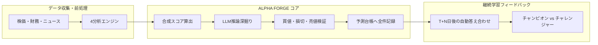

# はじめに

日本株のAI銘柄スクリーニング＆継続学習端末**「ALPHA FORGE（アルファフォージ）」**を個人で設計・開発・運用しています。

本作の開発にあたり、AnthropicのCLIツール**Claude Code**を活用したところ、**Markdown 1枚のプロンプトを起点に、約25時間（27コミット）で要件定義・設計書からバックエンド・フロントエンド画面まで一通り動くフルスタックシステム**が立ち上がりました。

本記事では、AIエージェントに自走して開発させる上で最も重要だった**「コードを書かせる前に制約（約束）を書き切る設計アプローチ」**と、コンテキスト喪失やAPI利用制限を乗り越えて自走させ続けるためのファイル設計ノウハウを共有します。

:::note info
**【要約：本記事の3行まとめ】**
- Markdown 1枚の「構築プロンプト」を渡し、約25時間で計画から全画面まで動く端末が完成
- 速さの正体は「先に破ってはいけない約束（設計原則）を書き切ったこと」
- 計画書とタスクリストをリポジトリ内に永続化すれば、AIのRate Limit（利用制限）にも一言で復帰できる

※本記事はnote連載［ALPHA FORGE 開発秘話 #01］(https://note.com/featured_stocks/n/nb553ed30e90d?sub_rt=share_sb) の設計・実装ノウハウを技術者向けに再構成したものです。
:::

---

# 1. 開発したシステム概要（ALPHA FORGE）

今回構築したのは、日本株市場のスクリーニングと自己改善を行うAI端末です。

## アーキテクチャ構成
- **バックエンド**: Python 3.11 / FastAPI, Celery + Redis, SQLAlchemy（async）, SQLite + Alembic
- **フロントエンド**: Next.js 16 (App Router), TypeScript, Vanilla CSS（Tailwind は使わない方針。デザイントークンは CSS 変数で一元管理）
- **主要機能**:
  - 多角的な市場データ収集（日足、財務指標、ランキング、マクロ指標）
  - 4つの分析の柱によるスコアリング（テクニカル、トレンド、ファンダメンタル、ニュース感情）
  - LLMによる推論深掘りと推論トレース（思考プロセスの可視化）
  - 予測台帳（Prediction Ledger）への全シグナル記録とT+N日後の自動正解判定
  - チャンピオン／チャレンジャー方式によるモデル評価・昇格ゲート



---

# 2. 出発点：「当たったか」を覚えていないツールの限界

ALPHA FORGEには前身ツール（毎朝市況とスクリーニング結果を要約してくれる自作スクリプト）がありました。
しかし、運用を続ける中で決定的な課題に直面しました。

**「昨日の予想が当たったのか外れたのか、ツール自身が覚えていない」**

毎朝どれだけもっともらしい銘柄を推薦してくれても、その後の値動きを振り返って反省・学習する仕組みがなければ、システムは何年経っても賢くなりません。人間の投資家なら売買日誌をつけて振り返るはずです。

そこで、新システム開発のコアコンセプトを次のように定めました。

> **「すべての予測を台帳に記録し、自分の実測した答え合わせだけで自律的に育っていくAI」**

---

# 3. コードを書かせる前に「破ってはいけない6つの約束」を定義する

2026年9月10日、開発開始時にClaude Codeに渡したのは、Markdown 1枚で書かれた`新規プロジェクト構築プロンプト.md`と、次の一言だけでした。

```bash
新規プロジェクト構築プロンプト.md を参照して本フォルダで構築してください
```

このプロンプトでは、作りたい機能の一覧以上に**「絶対に破ってはいけない設計原則（制約）」**を厳格に指定しました。

| 原則 | 内容 | 技術的・運用の意図 |
|---|---|---|
| **① 予測の完全台帳記録** | AIが出した予測は、その時点の入力・スコア・タイムスタンプごと全件永続化する | 後日の実測データによる正解ラベル付与と、データリークのない学習データ生成のため |
| **② 価格の3値バリデーション** | 売買候補は「推奨買値・損切値・売値」を必須とし、`損切 < 買値 < 売値` をサーバ側で検証 | 不整合な推論結果はサーバ側で却下するか、値動きのブレ幅（ATR）ベースの目安ブラケットで補完するため |
| **③ 人間承認ゲート** | 学習済みチャレンジャーモデルの昇格判定は提案までとし、本番切り替えは人間が行う | AIによる意図しない暴走や過学習モデルの無断デプロイを防止するため |
| **④ 発注機能の完全排除** | 証券会社への自動発注API・連携機能は一切実装しない | 安全性担保、および金融商品取引法（投資助言規制・一任運用）の遵守 |
| **⑤ 日本株UIカラー規約** | 上昇＝赤、下落＝緑を厳守（海外標準の逆） | 開発者のドメイン固有の認知負荷を下げ、直感的な視認性を確保するため |
| **⑥ 外部テキストをプロンプトに入れない** | ニュース本文などの外部由来テキストはLLMプロンプトへ注入せず、載せるのは数値・enum・frontmatterなどの構造化フィールドだけにする | プロンプトインジェクション（指示の乗っ取り）を、境界モジュールとテストで構造的に防ぐため |

:::note warn
AIエージェントに開発を任せる際、「自由に作って」と指示すると、便利そうに見える余計な機能（自動発注や複雑すぎるDB設計など）を勝手に盛り込み、後から修正不能な負債になります。
**「何をやってはいけないか」という境界線をプロンプトで先に敷くこと**が、手戻りをゼロにする最大のポイントです。
:::

---

# 4. 25時間・27コミットの開発タイムライン

指示を出した翌朝、まずAIが最初に行ったのはコードを書くことではなく、**ドキュメントの生成とコミット**でした。

```text
2026-09-11 06:43 [commit 1] docs: P0 計画ドキュメント一式を追加
```

リポジトリ内に以下のファイル群が自動的に整備されました：
- `plans/00_調査サマリ_…移植棚卸し.md`（前身ツールからの移植棚卸し）
- `plans/01_PRD.md`（要件定義）
- `plans/02_アーキテクチャ.md`（アーキテクチャ設計）
- `plans/03_システム設計.md`（システム設計）
- `plans/04_タスクリスト.md`（フェーズ別タスクリスト）
- `plans/05_決定ログと未決事項.md`（決定の理由と未決事項）

タスクリストが確定してからは、AIはタスクリストの順番に沿って粛々と実装を進めました：

1. **データ収集基盤**: 株価、財務、ランキング、マクロ指標の取得クライアント
2. **分析エンジン**: テクニカル / トレンド / ファンダメンタル / ニュース感情の4スコア算出
3. **推論と台帳**: スコア合成、LLM深掘り推論、予測台帳への永続化、T+N日正解判定
4. **キャリブレーション**: 自信度スコアを実際の的中率にキャリブレーションする補正機構
5. **モデル管理**: Champion / Challenger のモデル昇格ゲート
6. **UIフロントエンド**: Next.js によるダッシュボードと推論トレース画面
7. **ポートフォリオ監視**: 承認制ポートフォリオ管理と、通知センター＋Web Pushによる通知

そして、**開始から約25時間後の9月12日朝07:28に「全フェーズ完了」のコミット（計27コミット）**が完了しました。

---

# 5. 人間の作業実態とRate Limit（利用制限）からの復帰法

「25時間でフルスタック開発」と聞くと、人間が横で高度なペアプロンプトを打ち込み続けたように思えるかもしれません。
しかし、実際の会話ログを振り返ると、人間の入力の大半は以下の2語でした。

```text
「次」
「続行」
```

人間が行っていた実作業は以下の3点のみです：
1. データ取得用の外部ツールのセットアップやAPIキーの発行
2. 生成されたコミットのプッシュ（`git push`）
3. 立ち上がった画面をブラウザで開いて触ってみる受入確認

## AIのRate Limit（利用上限）に達したときの対処
開発の山場で、Claude Code の利用上限に到達して作業が一時中断しました。
利用上限がリセットされたあと、入力したのはこの一文だけでした。

```text
「作業中に利用制限に達しましたが、現在はリセットされています。中断したところから続けてください。」
```

AIは何の混乱もなく、**中断したタスクの直後から実装を正確に再開**しました。

なぜこれが可能だったのか？理由はシンプルです。
**計画書・タスクリスト（完了チェックボックス付き）・コミットログがすべてリポジトリ内のファイルとして永続化されていたから**です。
会話コンテキストが完全に切断されても、AIはリポジトリの最新ファイルを読むことで、「現在の進捗と次のタスク」を自分で確認できます。

---

# 6. 得られた知見（AIエージェント開発を成功させる3原則）

今回の開発を通じて得られた、AIエージェント開発における重要な知見は以下の3点です。

## ① ゼロから書かせない（移植を第一選択にする）
前身ツールで実績のあったデータ取得やスコアリングのロジックは、新規に生成させるのではなく「既存部品を移植すること」を最優先指示に含めました。検証済みのコードをベースにすることで、デバッグの時間を大幅に削減できます。

## ② 記憶を会話履歴ではなく「リポジトリ内のMarkdown」に持たせる
AIエージェントの会話履歴は揮発性です。コンテキストウィンドウの枯渇やセッション中断に備え、要件定義書・タスクリスト・決定事項は必ずMarkdownファイルとしてリポジトリに保存させます。

## ③ フェーズ単位でコミットさせ、セーブポイントを作る
タスク1つ、またはフェーズ1つ終わるごとにコミットを作らせることで、万が一予期せぬ変更が発生しても即座に安全な地点へロールバックできるようにしました。27個のコミット履歴はそのまま品質の足場となりました。

---

# まとめと次回予告

Claude Codeのような自律型AIエージェントは、適切な「制約」と「ファイルベースのタスク設計」を与えることで、エンジニアの強力なパートナーとしてフルスタックのプロダクトを一気に形にしてくれます。

しかし、「一通り動くシステムができた」ことと、「毎朝本番環境で確実に動き続ける」ことの間には、想像以上に深い谷がありました。

次回は、完成から2日目の朝に発生した**「たった1銘柄の不調が、全銘柄のAIピックを道連れにして全滅したインシデント」**と、その教訓から学んだ耐障害性設計についてお届けします。

---

# ☕ note.comにて日々のAI分析＆開発記録を連載中

note.comでは、ALPHA FORGEが毎朝出力する実際のAIピック思考トレースや、本連載の開発裏話をリアルタイムに発信しています。
投資AI端末の成長プロセスや、市場データとAIが格闘する日々のログに興味がある方は、ぜひnoteもあわせてご覧ください！

👉 **note連載第1話はこちら**:  
[【ALPHA FORGE 開発秘話 #01】構築プロンプト1枚から、2日で「育つAI端末」が立ち上がるまで](https://note.com/featured_stocks/n/nb553ed30e90d?sub_rt=share_sb)

---

:::note info
**免責事項**
本記事は個人開発およびAIエージェントを活用したシステム設計の技術研究記録です。金融商品取引法を遵守し、特定の銘柄の売買推奨や投資助言を行うものではありません。
:::
