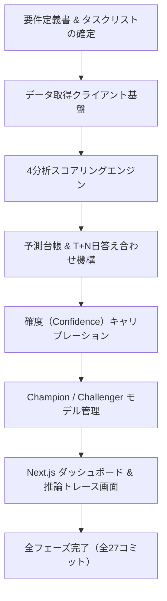

# はじめに

日本株のAI銘柄スクリーニング＆継続学習端末**「ALPHA FORGE（アルファフォージ）」**を個人で設計・開発・運用しています。

先日、AnthropicのCLIツール**Claude Code**を使ってこの端末をフルスクラッチ（既存ロジック移植含む）で再構築したところ、**Markdown 1枚のプロンプトからスタートして、わずか25時間（27コミット）で設計書から画面まで一通り動くシステムが完成**しました。

:::message
**【要約：この記事で伝えたいこと】**
AIエージェントに自走して開発させる際、最も重要なのは「コードを書かせること」ではなく**「破ってはいけない制約（約束）を先に書き切ること」**でした。
AIを迷走させずに爆速で立ち上げるための設計原則と、API利用制限（Rate Limit）にも動じないファイル管理術を紹介します。

※本記事はnote連載［ALPHA FORGE 開発秘話 #01］(https://note.com/featured_stocks/n/nb553ed30e90d?sub_rt=share_sb) の設計・実装ノウハウを開発者コミュニティ向けに再構成したものです。
:::

---

# 1. 背景：「当たったか」を覚えていないツールの限界

ALPHA FORGE には前身となる自作スクリプトがありました。毎朝、市場データとスクリーニング結果をまとめてくれるツールです。

日々の運用自体は便利だったのですが、使い続けるうちにどうしても拭えない違和感がありました。

> **「昨日の予想が当たったのか外れたのか、ツール自身が覚えていない」**

毎朝どんなにもっともらしい銘柄をピックアップしても、数日後に株価が上がったのか下がったのかを振り返り、自らのモデルやスコアにフィードバックする仕組みがありませんでした。これでは何年回してもツールは賢くなりません。

人間の投資家であれば、売買ノートをつけて反省し、次に活かすはずです。そこで、新しく作る端末のテーマを決めました。

**「予測を全部記録して、自分の実測データだけで自律的に育っていくAI」**

---

# 2. 最初にやったのは「コードを書かせる」ではなく「約束を書く」こと

2026年9月10日。私がClaude Codeに渡したのは、Markdown 1枚の`新規プロジェクト構築プロンプト.md`と、次の一言だけでした。

```bash
新規プロジェクト構築プロンプト.md を参照して本フォルダで構築してください
```

このプロンプトには、作りたい機能以上に**「絶対に破ってはいけない約束（設計原則）」**を書き込みました。

:::details 破ってはいけない6つの約束（アコーディオンを開く）
1. **予測をすべて台帳に記録する**
   - AIが出した予測シグナルは、その時点の入力特徴量・タイムスタンプごと全件保存する。
   - 後日「T+N営業日後にどう動いたか」で自動的に決着（正解ラベル付与）をつける。
   - 再学習に使うデータは、この自分の実測記録のみとする。
2. **売買候補を出すなら「3つの価格」を必ずセットにする**
   - 推奨買値・損切値・売値の3値を必須化。
   - `損切 < 現在値 < 売値` かつ `損切 < 買値 < 売値` をサーバ側で検証し、崩れている推論結果は却下するか、値動きのブレ幅（ATR）ベースの目安ブラケットで補完する。
3. **AIに勝手にモデルを入れ替えさせない**
   - 新しく学習したモデル（チャレンジャー）が既存モデル（チャンピオン）の勝率を上回っても、自動デプロイはせず「昇格提案」にとどめる。
   - 本番適用のトリガーは人間が引く（ヒューマン・イン・ザ・ループ）。
4. **発注機能は絶対に持たない**
   - 証券会社へのAPI自動発注や注文連携は一切実装しない。
   - 金融商品取引法（投資助言規制・一任運用の回避）の遵守と、暴走による資金損失リスクを原理的に排除する。
5. **UIカラーの厳格定義（上昇＝赤、下落＝緑）**
   - 海外ツール標準（上昇＝緑、下落＝赤）ではなく、日本株市場の標準（上昇＝赤、下落＝緑）を最初からUIコンポーネントの共通規約として縛る。
6. **外部テキストをそのままプロンプトに注入しない**
   - ニュース本文などの外部由来テキストはLLMプロンプトへ注入しない。載せるのは数値・enum・frontmatterなどの構造化フィールドだけにし、その境界を専用モジュールとテストで固定する（プロンプトインジェクション対策）。
:::

:::message alert
**AIエージェントに「自由に作って」は禁物**
制約のないAIは「よかれと思って」過度に複雑なフレームワークを入れたり、不要な自動化機能を実装し始めたりします。最初から「守るべきルール」で外堀を埋めておくことが、迷走を防ぐ最大の防壁になります。
:::

---

# 3. 約25時間・27コミットで動くものが完成するまで

指示を受けたClaude Codeが最初に行ったのは、コードの生成ではなく**ドキュメントの生成と初期コミット**でした。

```bash
2026-09-11 06:43 [commit 1] docs: P0 計画ドキュメント一式を追加
```

リポジトリ直下に以下のファイル群が作られ、タスクが細分化されました。

- `plans/00_調査サマリ_…移植棚卸し.md`（前身ツールからの移植棚卸し）
- `plans/01_PRD.md`（要件定義）
- `plans/02_アーキテクチャ.md`（アーキテクチャ設計）
- `plans/03_システム設計.md`（システム設計）
- `plans/04_タスクリスト.md`（フェーズ別タスクリスト）
- `plans/05_決定ログと未決事項.md`（決定の理由と未決事項）



最初のコミットからタスクリストのチェックボックスが1つずつ埋まっていき、翌9月12日の朝07:28には「全フェーズ完了」のコミットが入りました。**所要時間は約25時間、コミット数は27**でした。

---

# 4. 人間の作業実態と、AIの利用上限からの復帰劇

この25時間、人間は何をしていたのでしょうか。
会話ログを見返すと、私の発言の大半は以下の2語でした。

```text
「次」
「続行」
```

人間が実際に担当したのは以下の作業だけです：
- データ取得に必要な外部ツールのセットアップやAPIキーの払い出し
- `git push` によるリモート同期
- 出来上がった画面をローカルブラウザで開き、手触りを確認すること

## 作業中にAIの利用上限に到達
開発が佳境に入ったところで、Claude Codeの利用制限に引っかかり、作業が強制中断しました。
枠がリセットされたあとに打ち込んだのは、この一文だけです。

```text
「作業中に利用制限に達しましたが、現在はリセットされています。中断したところから続けてください。」
```

AIは一切の文脈を失うことなく、**直前まで作業していたタスクの次の工程から何事もなかったかのように再開**しました。

### なぜコンテキストが切れても即復帰できたのか？
秘密は**「リポジトリ内にタスクリストと設計書がMarkdownファイルとして存在していたこと」**です。
AIはセッションがリセットされても、リポジトリの `plans/04_タスクリスト.md` を読めば「何が完了していて、次は何をすべきか」を自己把握できます。

AIエージェントの会話履歴という「揮発性のメモリ」に頼るのではなく、**「リポジトリという永続ストレージ」に記憶を持たせる**ことが極めて有効でした。

---

# 5. 振り返って思う「速さの正体」3選

今回の開発を通して実感した、AI協調開発を成功させるためのエッセンスは以下の3点です。

## 1. ゼロから書かない（枯れた部品を移植する）
前身ツールで動いていたスクリーニングやデータ取得のロジックは「新規開発」ではなく「移植を第一選択」としました。検証済みのロジックを流用することで、ロジック面のバグ混入を劇的に減らせます。

## 2. 計画書・タスクリストを最初からリポジトリに置く
AIとのチャット画面だけで仕様を決めず、初手でMarkdownの設計書一式を出力させてコミットさせます。これにより、コンテキスト長制限・セッション切断・日を跨いだ作業でも1ミリもブレずに開発を継続できます。

## 3. こまめなコミット＝セーブポイント
27個のコミットは、すべて「ここまで正常に動く」というセーブポイントになりました。AIが途中で変なコードを書いたとしても、直前のコミットに戻るだけでノーダメージでやり直せます。

---

# まとめと次回予告

Claude Codeのような自律型エージェントを使うと、要件定義から実装、テストまでのスピードは従来の何倍にも加速します。
しかし、そのスピードを支えているのは**「最初に設計原則と制約をガチガチに定義したこと」**でした。

「一通り動くシステムができた！」と喜んだのも束の間、本番稼働2日目の朝に**「たった1銘柄のエラーが原因で、全銘柄のAIピックが道連れになって全滅する」**という手痛い洗礼を浴びることになります……。

次回は、その全滅インシデントの顛末と、そこから実装した**「パイプラインの絶縁・耐障害性設計」**について書く予定です。

---

# ☕ note.comにて日々のAI分析＆開発記録を連載中

note.comでは、本ツールの思考トレース画面や日々のAIスクリーニング結果、個人開発の泥臭い奮闘記をリアルタイムにお届けしています。  
「AIが市場データをどう解釈しているのか」「自作AI端末がどう育っていくのか」を追ってみたい方は、ぜひnoteのフォローやスキ（ハート）をいただけると深夜のデバッグの大きな励みになります！

📖 **note連載第1話（元記事）はこちら**:  
[【ALPHA FORGE 開発秘話 #01】構築プロンプト1枚から、2日で「育つAI端末」が立ち上がるまで](https://note.com/featured_stocks/n/nb553ed30e90d?sub_rt=share_sb)

---

:::message
**免責事項**
本記事は個人開発およびAIエージェント技術の検証記録です。金融商品取引法を遵守し、個別銘柄の売買判断や投資アドバイスを行うものではありません。
:::
